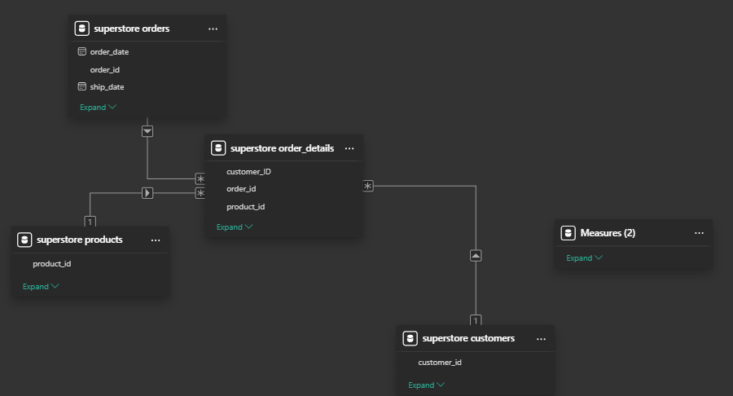

# Sales_analytics
📊 Retail Superstore Sales & Profit Analysis (End-to-End Data Analytics Project)
🔹 Project Overview

This project analyzes Retail Superstore sales data to uncover insights on customers, products, regions, and profitability.
It demonstrates a complete data analytics workflow using SQL, Python, and Power BI, designed to mimic real-world business reporting.

🔹 Tech Stack

SQL (MySQL): Database design, data normalization, joins, KPIs.

Python (Pandas, Numpy, Matplotlib, Seaborn, Plotly, SQLAlchemy): Advanced analysis and visualizations.

Power BI: Interactive dashboards for executive decision-making.

🔹 Database Schema (ER Diagram)

The dataset was normalized into 4 tables:

customers (customer_id, customer_name, segment, region, country)

products (product_id, product_name, category, sub_category)

orders (order_id, order_date, ship_date, ship_mode)

order_details (order_id, product_id, customer_id, sales, profit, quantity, discount)

👉 ER Diagram:

🔹 Steps Taken
1. Data Cleaning & Preparation

Handled duplicates, missing values, and inconsistent customer IDs.

Normalized data into relational tables to avoid anomalies.

Loaded cleaned CSVs into MySQL using LOAD DATA INFILE.

2. SQL Analysis

Sample queries:

-- Total Sales by Region
SELECT region, SUM(sales) AS total_sales
FROM customers c
JOIN order_details od ON c.customer_id = od.customer_id
GROUP BY region
ORDER BY total_sales DESC;

-- Top 3 Products by Sales in each Category
SELECT category, product_name, SUM(sales) AS total_sales
FROM products p
JOIN order_details od ON p.product_id = od.product_id
GROUP BY category, product_name
ORDER BY category, total_sales DESC
LIMIT 3;

3. Python Analysis

Connected MySQL with SQLAlchemy.

Used Pandas for queries and cleaning.

Visualized:

Sales trends over time (line charts).

Discount vs Profit (scatter).

Customer contribution to revenue (Pareto).

👉  visualization preview:

4. Power BI Dashboard

Created a 4-page interactive dashboard:

Executive Overview → KPIs, Sales by Category, Monthly Trend, Top Customers.

Customer Insights → Segment analysis, Regional distribution, Top 10 Customers.

Product & Profitability → Sub-category profit, Discount impact, Top products.

Trends & Forecasting → Sales forecast, Yearly profit comparison.

👉 Dashboard Preview:

🔹 Key Insights

📉 High discounts reduce profit, especially in Furniture.

🏆 Technology category contributes the most to profit.

🌍 West region generates highest sales; East has more customers.

👥 20% of customers generate 80% of revenue (Pareto principle).

🔹 Deliverables

SQL Scripts → 
Jupyter Notebook → 
Power BI Dashboard → dashboard/superstore.pbix
Project Report → docs/report.pdf

🔹 How to Run

Clone this repo.

Import CSV data into MySQL using provided scripts.
Run Python notebook for analysis.
Open Power BI .pbix file for interactive dashboards.

🔹 Author

👤 Deepchandra Chouryal
💼 Aspiring Data Analyst | SQL | Python | Power BI
📧 Chouryaldeep777@gmail.com
🔗 LinkedIn
